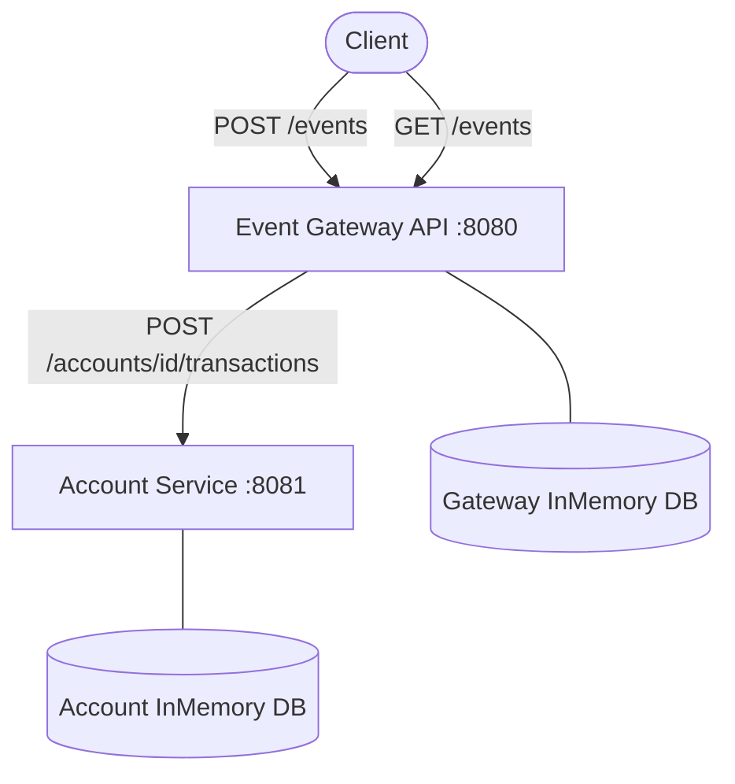

# Event Ledger (.NET 8)

Cloud-native Event Ledger solution with two independent microservices:

- **Event Gateway API** (`src/EventGateway.Api`) — public-facing, accepts events, stores them locally, and coordinates Account Service
- **Account Service** (`src/AccountService.Api`) — internal, maintains account balances

## Architecture diagram



## Architecture overview

Each service is independently runnable and follows a **Clean Architecture** split:

| Layer | Responsibility |
|---|---|
| `Domain` | Entities and enums; no external dependencies |
| `Application` | CQRS commands/queries via MediatR, FluentValidation pipeline, idempotency |
| `Infrastructure` | EF Core InMemory persistence, outbound HTTP adapters (Gateway only) |
| `Api` | Controllers, Serilog setup, OpenTelemetry wiring |

### Service interactions

1. A client `POST /events` to the **Event Gateway**.
2. The Gateway validates and idempotency-checks the incoming event (duplicate `eventId` returns immediately).
3. The Gateway calls the **Account Service** `POST /accounts/{accountId}/transactions` synchronously, forwarding the W3C `traceparent` header.
4. On success, the Gateway persists the event locally and returns `201 Created`.
5. If the Account Service is unreachable the Gateway returns `503 Service Unavailable` — read endpoints (`GET /events`) continue to work from the local store.

### Implemented capabilities

- .NET 8 Web APIs
- Independent in-memory databases per service
- Synchronous REST communication (Gateway → Account)
- Per-EventId locking for atomic idempotency (concurrent requests with the same `eventId` are serialized)
- Out-of-order tolerance with timestamp sorting
- Health checks (`/health`)
- Serilog structured JSON logs
- OpenTelemetry tracing + metrics
- W3C trace context propagation (`traceparent`)
<<<<<<< HEAD
- Custom metrics: request count by endpoint, latency histogram, and error rate — exposed via Prometheus at `/metrics`
- Polly resiliency on Gateway outbound calls (timeout + retry with exponential backoff)
- Graceful degradation (Gateway `POST /events` returns `503` when Account service is unavailable; reads continue from local DB)

## Custom metrics

Both services instrument every HTTP request with three custom metrics exposed via a Prometheus-compatible `/metrics` endpoint.

| Metric | Type | Tags | Description |
|---|---|---|---|
| `event_gateway_requests_total` / `account_service_requests_total` | Counter | `endpoint` | Request count per endpoint |
| `http_request_duration_ms` | Histogram | `endpoint`, `status_code` | End-to-end request latency in milliseconds |
| `http_request_errors_total` | Counter | `endpoint`, `status_code` | Count of requests that returned a 4xx or 5xx response |

The request counter is recorded per controller action (tagged with the route template, e.g. `POST /events`).  
The latency histogram and error counter are collected by `RequestMetricsMiddleware` and wrap every request, including health checks and unmatched routes.

All three instruments belong to a named `Meter` (`EventGateway.Api` / `AccountService.Api`) subscribed to by the OpenTelemetry SDK, which exports them both to the console and to the Prometheus scraping endpoint at `/metrics`.

### Scraping metrics locally

```bash
# Event Gateway metrics
curl http://localhost:8080/metrics

# Account Service metrics
curl http://localhost:8081/metrics
```
=======
- Polly resiliency on Gateway outbound calls (retry with exponential backoff, circuit breaker, per-attempt timeout)
- Graceful degradation (Gateway POST returns `503` when Account service is unavailable; reads continue from local DB)
>>>>>>> origin/copilot/event-ledger-project

## Endpoints

### Event Gateway API

| Method | Path | Description |
|---|---|---|
| `POST` | `/events` | Submit a new event |
| `GET` | `/events/{id}` | Retrieve event by ID |
| `GET` | `/events?account={accountId}` | List events for an account (sorted by timestamp) |
| `GET` | `/health` | Health check |
| `GET` | `/metrics` | Prometheus metrics scraping endpoint |

### Account Service

| Method | Path | Description |
|---|---|---|
| `POST` | `/accounts/{accountId}/transactions` | Apply a transaction |
| `GET` | `/accounts/{accountId}/balance` | Get current balance |
| `GET` | `/accounts/{accountId}` | Get account details with transaction history |
| `GET` | `/health` | Health check |
| `GET` | `/metrics` | Prometheus metrics scraping endpoint |

## Prerequisites

- [.NET 8 SDK](https://dotnet.microsoft.com/download/dotnet/8.0)
- [Docker Desktop](https://www.docker.com/products/docker-desktop/) (for Docker Compose run)

Restore NuGet packages before building:

```bash
dotnet restore EventLedger.slnx
```

## Setup

### Prerequisites

- .NET 8 SDK
- Docker Desktop (or Docker Engine + Docker Compose plugin) for containerized startup

### Install dependencies

```bash
dotnet restore EventLedger.slnx
```

## Run locally

Start Account Service first (Gateway depends on it):

```bash
dotnet run --project src/AccountService.Api/AccountService.Api.csproj
```

In a second terminal, start Event Gateway:

```bash
dotnet run --project src/EventGateway.Api/EventGateway.Api.csproj
```

The Gateway reads `AccountService__BaseUrl` from environment (default `http://localhost:8081`).  
Override it by setting the variable before running:

```bash
AccountService__BaseUrl=http://localhost:8081 dotnet run --project src/EventGateway.Api/EventGateway.Api.csproj
```

Build the full solution:

```bash
dotnet build EventLedger.slnx
```

## Run tests

```bash
dotnet test EventLedger.slnx
```

Test coverage includes:

- Idempotency (duplicate `eventId` is not re-applied)
- Out-of-order correctness (events applied regardless of arrival order)
- Balance correctness (`CREDIT - DEBIT`)
- Validation behavior (invalid payloads rejected with errors)
- Resiliency behavior under Account Service failure (Gateway returns `503`)
- Trace propagation (`traceparent` forwarded to Account Service)
- Full Gateway → Account integration flow

## Docker

```bash
docker compose up --build
```

- Event Gateway: `http://localhost:8080`
- Account Service: `http://localhost:8081`

Both services are connected via a shared `event-ledger-net` Docker network.

## Resiliency choice

<<<<<<< HEAD
The Gateway uses Polly **timeout + retry with exponential backoff** on all outbound Account Service calls:

| Concern | Configuration |
|---|---|
| Timeout per attempt | 2 seconds (Polly `TimeoutAsync`) |
| Retries | 3 attempts |
| Backoff | 200 ms → 400 ms → 800 ms |
| Transient errors handled | 5xx responses, network errors, timeouts |
=======
Gateway uses Polly (outer → inner policy order):

- **Retry** (3 attempts, exponential backoff: 200ms / 400ms / 800ms)
- **Circuit breaker** (opens after 5 consecutive failures, stays open for 30s)
- **Per-attempt timeout** (2s)
>>>>>>> origin/copilot/event-ledger-project

`HttpClient.Timeout` is set to `Timeout.InfiniteTimeSpan` so it does not compete with the Polly timeout policy; all timeout control is handled exclusively by Polly.

When all retries are exhausted the Gateway surfaces `503 Service Unavailable` for `POST /events`. Read operations (`GET /events` and `GET /events/{id}`) are served entirely from the Gateway's local store and are unaffected by Account Service availability.
